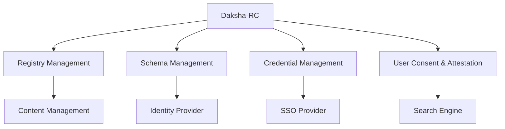

#Domain-Driven Design (DDD) for Daksha-RC-core
### Introduction
Daksha-RC-core adopts Domain-Driven Design (DDD) to effectively model its business domain and align the software design with the domain's structure and language. 
DDD enables Daksha-RC-core to organize the system into clearly defined components that reflect business concerns.

### Core Concepts in Daksha-RC-core’s Domain

**Registry**: The core concept in Daksha-RC is an electronic registry, which acts as a source of truth for entities such as people, organizations, or assets.

**Schema**: The schema defines the structure of data stored in the registry. It's essential in defining what entities can be registered and their attributes.

**Verifiable Credentials (VCs)**: These are digital credentials that can be issued and verified for entities. Daksha-RC allows the creation, issuance, and management of VCs.

**User Consent & Attestation**: Daksha-RC supports managing user consent and attestation for registered data, ensuring GDPR compliance and trustworthiness of credentials.

**Event Sourcing & CQRS**: The system employs event sourcing to ensure that every change is traceable and Command Query Responsibility Segregation (CQRS) to handle reads and writes efficiently.

### Identifying Bounded Contexts

A key DDD principle is breaking down the domain into bounded contexts, each representing a well-defined part of the business logic.

### Registry Management Context

This context is responsible for creating, maintaining, and querying registries. The Registry Management Context manages:

**Schemas**: Definitions of entities that can be registered (e.g., person, organization).
    
**Commands**: To create, update, and delete records in the registry.
    
**Events**: Capture changes like “RegistryCreated,” “RecordUpdated,” etc.

**Queries**: To retrieve and search through the registries.

#### Entities: {id="entities_1"}

- **Registry**: Represents a specific registry instance. 
 
- **Record**: Represents an entry in the registry, conforming to a schema.

#### Aggregates

- **RegistryAggregate**: Holds the state and enforces business rules around registries.

### Schema Management Context

This context manages the lifecycle of schemas and ensures the validity of data being stored in the registries. The schemas act as templates or blueprints for what can be stored in the registry.

#### Entities: {id="entities_2"}

- **Schema**: Defines the structure and constraints of data for each registry type.

- **Services**:

- **SchemaService**: Manages schema versioning, validation, and ensures the schema adheres to business rules.

- **Aggregates**:

- **SchemaAggregate**: Ensures that schemas are properly versioned and valid before being applied to a registry.

### Credential Management Context

This context deals with the issuance, management, and verification of Verifiable Credentials. It allows external parties to validate information registered within the system.

#### Entities:

- **VerifiableCredential**: Represents a credential issued based on the registry data.

**Services**:

- **CredentialIssuerService**: Handles issuing of VCs.

- **CredentialVerificationService**: Provides mechanisms to verify the authenticity of VCs.

**Aggregates**:

- **CredentialAggregate**: Enforces business rules around the issuance and verification of credentials.

### User Consent and Attestation Context

This context handles user consent and attestation for the data held in registries, ensuring compliance with legal requirements and maintaining trust in the system.

**Entities**:

- **Consent**: Represents the consent given by users to share or verify their information.
- **Attestation**: Represents proof that the data is accurate and trusted.

**Services**:

- **ConsentService**: Manages user consent workflows and stores consent decisions.
- **AttestationService**: Handles the attestation process, ensuring the validity of the records.

## External Systems and Integration

Daksha-RC-core integrates with several external systems via adapters:

- **Authentication & Authorization**: Integrated with external OAuth 2.0 and OpenID Connect providers to manage user authentication and role-based access control.
- **Messaging Systems**: Integration with message queues to handle asynchronous processing, such as issuing notifications when credentials are issued or updated.
- **Storage Adapters**: RDBMS, Document DB, and Columnar DB for handling persistent data storage, depending on the data structure requirements.

### Application Services and Ports

The core logic in Daksha-RC-core is encapsulated within application services:

**Command Handlers**: Process commands and apply business rules through the aggregates.
**Query Handlers**: Handle queries by reading from optimized read models, which could be stored in a separate database.

The application interacts with external systems via ports:

**Primary Ports**: Interfaces such as GraphQL, REST, and gRPC for external systems to communicate with Daksha-RC-core.

**Secondary Ports**: These include integrations like databases (RDBMS, Document DB), messaging systems (Message Queue), and external OAuth systems.

## Eventual Consistency and Scalability

In keeping with DDD principles and CQRS-ES, Daksha-RC-core ensures that commands (writes) and queries (reads) are handled separately, improving scalability. Event sourcing guarantees that the system state can always be reconstructed from a sequence of events, and eventual consistency is maintained between the command and query sides through asynchronous event propagation.

This domain-driven design breakdown ensures that Daksha-RC-core is highly maintainable, scalable, and flexible, allowing the system to evolve with changing business needs while keeping the core domain logic intact.

# Aggregate Design Canvas: Bank Account

## 1. Aggregate Root: `BankAccount`
The aggregate root is responsible for maintaining the integrity of the bank account and coordinating its associated commands and events.

---

## 2. State (Attributes)
These are the internal properties that represent the state of the bank account aggregate.

- **`accountId`: String**  
  The unique identifier of the bank account.
- **`balance`: Decimal**  
  The current balance of the bank account.
- **`status`: AccountStatus**  
  The current status of the account (e.g., Open, Closed, Overdrawn).

> **Note:** The state holds the current data of the account that is changed through commands and events.

---

## 3. Commands
Commands are the actions or operations that can be performed on the aggregate. They usually modify the state or trigger domain events.

- **OpenAccount(accountId, initialBalance)**  
  Opens a new bank account with the specified initial balance.

- **DepositMoney(accountId, amount)**  
  Deposits the given amount into the bank account.

- **WithdrawMoney(accountId, amount)**  
  Withdraws the specified amount from the bank account if the conditions allow.

- **CloseAccount(accountId)**  
  Closes the bank account, preventing further transactions.

> **Note:** Commands describe the intent to change the state but do not actually make the change directly.

---

## 4. Events
Events represent what has happened as a result of a command being processed. They are immutable and indicate changes in the aggregate's state.

- **AccountOpened(accountId, initialBalance)**  
  An event that indicates the account has been successfully opened.

- **MoneyDeposited(accountId, amount)**  
  An event that confirms money has been deposited into the account.

- **MoneyWithdrawn(accountId, amount)**  
  An event confirming that a withdrawal has occurred.

- **AccountClosed(accountId)**  
  An event indicating the account has been closed.

> **Note:** Events record state transitions and are used to rebuild the state of an aggregate.

---

## 5. Invariants (Business Rules)
Invariants are business rules that must always hold true for the aggregate to maintain a consistent state.

- **Balance cannot be negative**  
  The account balance cannot go below zero, except in overdraft scenarios (if applicable).

- **Account must be open to perform transactions**  
  All transactions (deposits, withdrawals) can only occur if the account status is 'Open'.

> **Note:** These business rules ensure the system adheres to its domain requirements and prevents invalid state transitions.

---

## 6. External Systems & Dependencies
The aggregate may interact with external systems or require data from other sources to validate certain commands.

- **Fraud Detection System**  
  Before opening an account, validation may occur with a fraud detection service.

- **Transaction Ledger**  
  The aggregate might interact with a ledger service to record all transaction activities.

---

## 7. Example Scenarios

### Opening a Bank Account
1. **Command**: `OpenAccount(accountId, initialBalance)`
2. **Event**: `AccountOpened(accountId, initialBalance)`
3. **New State**:
    - accountId: "12345"
    - balance: 100.00
    - status: Open

### Withdrawing Money
1. **Command**: `WithdrawMoney(accountId, 50)`
2. **Event**: `MoneyWithdrawn(accountId, 50)`
3. **New State**:
    - balance: 50.00
    - status: Open

---

## 8. Notes
- The BankAccount aggregate is responsible for enforcing business rules related to transactions and account status.
- All state changes occur in response to events, which are raised by processing commands.
- The aggregate is designed to prevent invalid operations, such as withdrawing more than the available balance or performing actions on a closed account.

