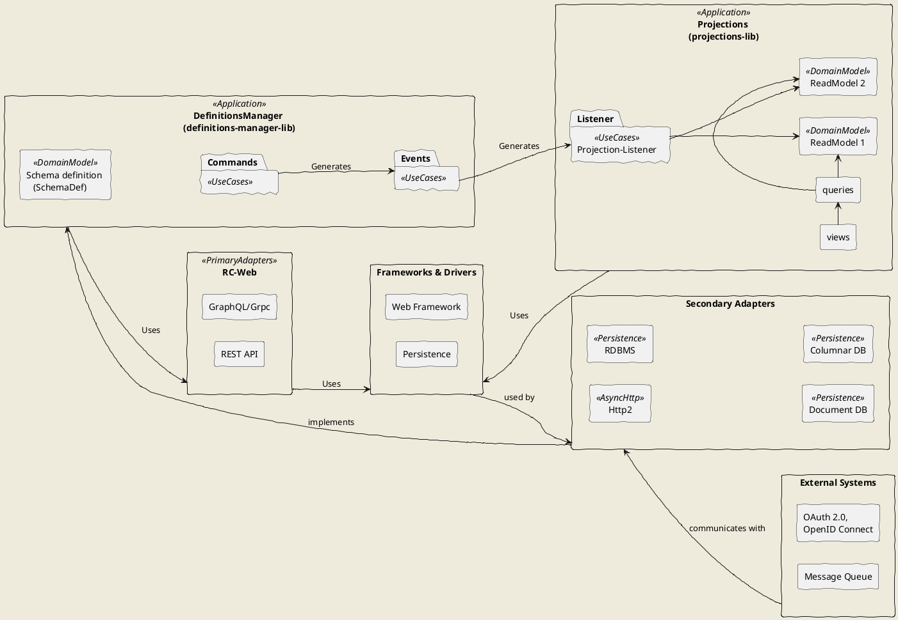
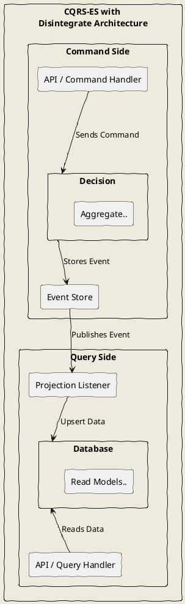

# High Level Design

Hexagonal Architecture provides a clear separation of concerns between the core business logic and the infrastructure.
The core business logic is implemented as a definitions-manager library.
Business logic is separated from the infrastructure using the repository pattern.
Allows for re-use across different infrastructure implementations.

For example, the initial release will focus on REST API, future versions will support GraphQL API and GRPC.

This above architecture diagram represents a system built using a layered structure, where components are segregated by
their roles and responsibilities.
At the center of the architecture is the DefinitionsManager (definitions-manager-lib), representing the core of the
application, which manages schema definitions (SchemaDef) and handles the use cases for commands, events, queries, and
views.
The SchemaDef holds the business logic. Commands and queries, are the use-cases which in turn generate events and access
views respectively.
This core module encapsulates the domain logic and enforces business rules through the use of commands and events,
following the CQRS (Command Query Responsibility Segregation) pattern.

The DefinitionsManager generates events which are processed by the projections-lib. Projections manage the lifecycle of
data in the ReadModels.
ReadModels serve specific purpose of the system, for example, efficient queries. Projections can be stored in one or
more storages.  
On the outer layers, the system interacts with the outside world through Primary Adapters, such as RC-Web, which
provides interfaces for communication via GraphQL/gRPC and REST API.
These adapters act as the entry points for external clients. Secondary Adapters are responsible for handling
interactions with various external systems, including Http2 for asynchronous communication, and different types of
databases such as RDBMS, Document DB, and Columnar DB for persistence.
The system also communicates with External Systems like OAuth 2.0/OpenID Connect for authentication and authorization,
and Message Queue for handling asynchronous events.
These interactions are managed and facilitated by the Frameworks & Drivers, which include a Web Framework and a
Persistence layer, acting as the glue between the core application and the external systems.

## CQRS-ES Architecture recap

### Quick Recap of CQRS-ES Architecture

The CQRS-ES (Command Query Responsibility Segregation and Event Sourcing) design pattern is a powerful architecture for
separating the read and write concerns of an application.
In this approach, the Command Side handles all write operations, processing commands via an API or command handler,
which interacts with the core business logic (represented as the Aggregate).
The results of these commands are stored in the Event Store as a sequence of events, capturing the changes made to the
system’s state over time.

The Projection Listener plays a central role in propagating these events to the Query Side, which handles all read
operations.
Read Models are inserted or updated accordingly. This Read model is optimized for queries
and stored in a dedicated Database.
The separation of commands and queries allows for flexible scaling, independent optimization of reads and writes, and a
complete history of changes through event sourcing, enabling auditability and replayability of events.
