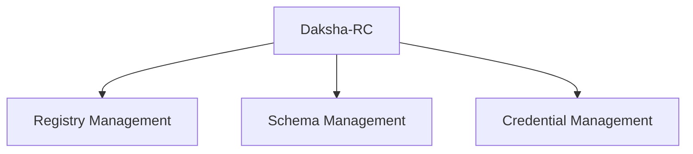

# SchemaDef-Aggregate-Design

## Aggregate Design Canvas: Bank Account

{style="header-row"}
<table border="1">
  <tr>
    <th colspan="3">Aggregate Design Canvas: Schema Definition</th>
  </tr>
  <tr>
    <td> <b>Name</b> 1. SchemaDef</td>
    <td rowspan="2" colspan="2">2. State (Attributes)
These are the internal properties that represent the state of the bank account aggregate.

- **`accountId`: String**  
  The unique identifier of the bank account.
- **`balance`: Decimal**  
  The current balance of the bank account.
- **`status`: AccountStatus**  
  The current status of the account (e.g., Open, Closed, Overdrawn).

> **Note:** The state holds the current data of the account that is changed through commands and events.
</td>
  </tr>
  <tr>
    <td> 2. <b>Description :</b> 
Responsibility of the aggregate root is to maintain the integrity of the schema definition and coordinate its associated commands and events.
</td>
  </tr>
  <tr>
    <td>Row 4, Col 1 

</td>
    <td>Row 4, Col 2

</td>
    <td>Row 4, Col 3</td>
  </tr>
  <tr>
    <td>Row 5, Col 1</td>
    <td>Row 5, Col 2</td>
    <td>Row 5, Col 3</td>
  </tr>
</table>
