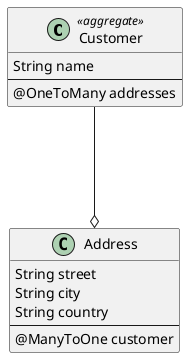

```plantuml
@startuml
class Customer << aggregate >> {
String name
--
@OneToMany addresses
}

    Customer -down--o Address
    class Address  {
String street
String city
String country
--
@ManyToOne customer
}

@enduml
```